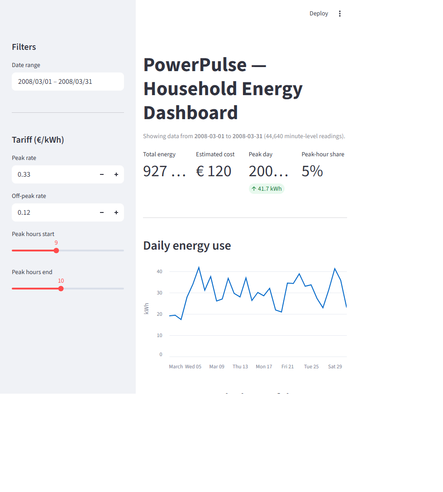
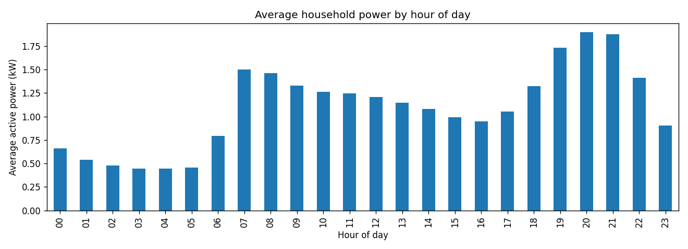
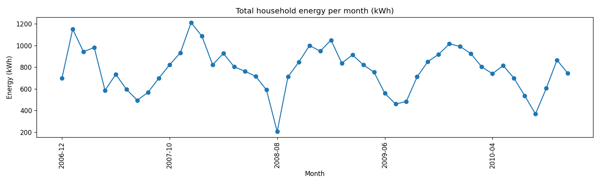

# Phase 7 — Beginner Walkthrough: Write-Up, Polish, and Publish

This is the phase most students skip and the phase hiring managers actually read.
A reviewer will spend **90 seconds on your README before they ever open code** —
and most of them will never run anything. The job of this phase is to make those
90 seconds count, then put the whole repo somewhere people can find it.

Three deliverables: a strong `README.md`, a one-page `findings_summary.md` for
non-technical readers, and a published GitHub repo with the link ready to paste into
your resume and LinkedIn.

Same rules: venv active when needed, **Check** after each step.

---

## Step 7.1 — What makes a portfolio README work

A great portfolio README does four things in order:
1. **Hooks** with a one-line "what this project is" and a striking image.
2. **States the business problem and the headline result** in the first half-page —
   before any technical detail.
3. **Lists tech stack and shows results visually** (screenshots, key chart images).
4. **Documents how to run it** so a reviewer who *does* clone it isn't lost.

What it does **not** do: dump 2,000 words of methodology. Long READMEs signal
"I don't know what's important." The methodology lives in your notebooks — the README
points to them.

## Step 7.2 — Create the README

Open VS Code, create `README.md` in your project root, and paste the template below.
Replace everything in `[BRACKETS]` with your real numbers from Phases 3, 4, and 6.

```markdown
# PowerPulse — Residential Energy Consumption Analytics

> End-to-end data analytics project on ~2 million rows of household smart-meter
> data. From raw `.txt` → cleaned SQL database → trend analysis → time-of-use
> tariff model → recurring Excel report → interactive Streamlit dashboard.



## The question

Could a household save real money by shifting *when* it uses electricity — and how
much, exactly? Using four years of minute-level smart-meter readings from a French
household, this project answers that with a quantified, validated number.

## Headline findings

- **The household consumes ~[TOTAL_KWH] kWh per year**, peaking in the evening
  (6–9pm) and in winter.
- **The water-heater / AC circuit is the single largest measured load** —
  ~[SUB3_PCT]% of metered consumption.
- **Switching to a time-of-use tariff is *more expensive* today** because the
  evening peak dominates. But if ~50% of the water-heater circuit's peak-hour
  energy is shifted off-peak (a timer is enough), the household saves
  ~**€[SAVINGS]/year** at illustrative tariff rates — a result that holds
  consistently across three independent full years of data.

## Tech stack

**Python** (pandas, NumPy, matplotlib, SQLAlchemy, openpyxl, Streamlit) ·
**SQL** (SQLite) · **Excel** · **Jupyter** · **Git**

## Repository

| Path | What's in it |
|---|---|
| `sql/` | Schema, data-load script, analysis queries |
| `notebooks/` | Cleaning & validation, exploratory analysis, business analysis |
| `reports/build_monthly_report.py` | Recurring monthly Excel report generator |
| `reports/figures/` | Chart images used in this README |
| `app/dashboard.py` | Interactive Streamlit dashboard |
| `PROJECT_GUIDE.md` | Project rationale, scope, and phase-by-phase roadmap |

## Selected charts

| | |
|---|---|
|  |  |
| Average power by hour of day — clear evening peak | Total energy by month — strong winter seasonality |

## How to run it

```bash
# 1. Clone and enter
git clone https://github.com/[YOUR_USERNAME]/powerpulse.git
cd powerpulse

# 2. Set up the environment
python -m venv venv
venv\Scripts\activate           # Windows
pip install -r requirements.txt

# 3. Get the data
#    Download "Individual Household Electric Power Consumption" from the UCI ML
#    Repository (dataset #235) and place household_power_consumption.txt in data/raw/.

# 4. Build the SQL database
python sql/load_data.py

# 5. Run the analysis (open in VS Code or Jupyter)
notebooks/01_cleaning_and_validation.ipynb
notebooks/02_exploratory_analysis.ipynb
notebooks/03_business_analysis.ipynb

# 6. Generate the monthly report
python reports/build_monthly_report.py 2008-03

# 7. Launch the dashboard
streamlit run app/dashboard.py
```

## Data quality & validation

This project takes data accuracy seriously. The cleaning notebook documents every
issue found and the decision made about it — including a sub-metering reconciliation
check that compares the household total against the three sub-meters to confirm the
data is internally consistent. See `notebooks/01_cleaning_and_validation.ipynb` for
the full data quality log.

## About this project

Built as a portfolio piece for a Data Analyst role by an Electrical & Computer
Engineering student. The energy-and-metering subject matter ties to the ECE
domain; the SQL / Python / Excel / dashboard stack maps to a typical analyst job.

Plain-language summary of findings: see [`reports/findings_summary.md`](reports/findings_summary.md).
```

**A note on the bracketed numbers:** open the relevant notebook, find the value,
and paste it. For `[TOTAL_KWH]`, the average across 2007–2009 from Phase 4 is
ideal. For `[SAVINGS]`, the 50%-shift number from Step 4.7. Round to whole numbers
in the README — precision belongs in the notebook, not on the front page.

## Step 7.3 — Embed the screenshots and figures

In the README template above, three image paths are referenced:
- `reports/figures/dashboard_full.png` (from Phase 6.11)
- `reports/figures/load_curve_by_hour.png` (from Phase 3.5)
- `reports/figures/monthly_energy_trend.png` (from Phase 3.8)

**Check:** all three files exist. If `dashboard_full.png` is missing, go back to
Phase 6.11 and take the screenshot. If the chart PNGs are missing, re-run those
notebook cells — `plt.savefig` was already in them.

Preview the README inside VS Code: right-click the file → "Open Preview". Images
should render, links should be blue. If an image shows a broken-image icon, the
path is wrong (case matters on most systems).

## Step 7.4 — Write the findings_summary.md

This is the **plain-language one-pager** a non-technical manager would actually read.
No code, no charts — just the story. Create `reports/findings_summary.md` and paste
the template below:

```markdown
# PowerPulse — Findings Summary

**Reading time: 2 minutes.** This document summarizes what we learned from analyzing
four years of household smart-meter data and what we recommend doing about it.

## What we did

We analyzed roughly two million minute-by-minute electricity readings from a
single French household between December 2006 and November 2010. The goal was to
answer one question: **could this household save money by changing *when* it uses
electricity, and how much?**

## What we found

1. **Consumption follows a clear daily and seasonal pattern.** The household uses
   the most power in the evening (6–9pm) and the most energy in winter. Weekends
   run slightly higher than weekdays, mostly because the morning hours fill in
   when nobody leaves for work.

2. **One circuit dominates the bill.** Of the three monitored circuits, the
   water-heater and air-conditioning circuit accounts for ~[SUB3_PCT]% of
   measured consumption — far more than the kitchen or laundry room. Lighting
   and outlets (the "unmetered" rest) make up the largest single share overall.

3. **A time-of-use tariff would cost *more* today, not less.** Because consumption
   is concentrated in peak evening hours, a switch from a flat-rate tariff to a
   peak/off-peak tariff would currently increase the annual bill by roughly
   €[GAP].

## What we recommend

1. **Put the water heater on an overnight timer.** Shifting ~50% of the
   water-heater circuit's peak-hour energy to off-peak hours saves an estimated
   **€[SAVINGS] per year** at illustrative tariff rates. This is the single
   biggest lever and requires no lifestyle change.

2. **Run laundry and dishwasher cycles overnight.** A smaller but real
   additional saving, achievable through delay-start timers on existing appliances.

3. **Switch to a time-of-use tariff *after* shifting load, not before.** The
   sequencing matters: TOU is more expensive at current usage, but becomes the
   cheaper option once the timer changes above are in place.

## How confident we are

- The savings figures were validated across three independent full years
  (2007, 2008, 2009). Results are consistent.
- Tariff rates are illustrative round numbers — the **methodology** transfers to
  real rates, the exact € amounts will vary with the actual contract.
- Roughly 1.25% of meter readings were missing (mostly multi-hour outages).
  Short gaps were interpolated; long gaps were excluded rather than fabricated.
  Full details in the data quality log within the cleaning notebook.

## What's not in scope

We did not model behavioral resistance (will the family actually use a timer?),
seasonal tariff variations, or capital costs (e.g. installing a heat pump). Those
would be natural next steps.
```

**Why this format works:** every section answers a question a manager would ask
("what did you do?", "what did you find?", "what should we do?", "should I trust
this?"). One page, no jargon, numbered findings and recommendations. That structure
is what makes it skimmable.

## Step 7.5 — Quality checks before publishing

Pretend you are the reviewer. Open the project folder fresh and ask:

- Is there a `README.md` at the root? Does the dashboard screenshot show right away?
- Are there exactly the folders the README claims (`sql/`, `notebooks/`, `reports/`,
  `app/`)? No clutter, no temp files?
- Does `.gitignore` still exclude `venv/`, `data/raw/`, `data/processed/`, and the
  `.db` file? **Run `git status` — nothing big or generated should be untracked.**
- Open each notebook. Are the markdown cells written? Do the cells run top-to-bottom
  without errors? (In VS Code: click the "Run All" arrow at the top.)
- Does the README's "How to run it" section actually match the file paths and script
  names in your repo? Walk through every command mentally.

If anything fails, fix it now. Reviewers don't give second chances.

## Step 7.6 — Publish to GitHub

If you don't already have a GitHub account, create one at **github.com/signup**. Use
a clean username — recruiters do look.

Create a new empty repository:
1. On github.com, top right → **+** → **New repository**.
2. Name it `powerpulse` (or whatever you like — short, lowercase, no spaces).
3. **Public.** Description: *"End-to-end data analytics project on household
   smart-meter data — SQL, Python, Excel, Streamlit."*
4. **Do NOT** tick "Add a README", "Add .gitignore", or "Choose a license" — you
   already have these locally and ticking them creates conflicts.
5. Click **Create repository**.

You'll see a page with setup commands. Use the **"…push an existing repository from
the command line"** block. In your terminal, from the project root:
```
git branch -M main
git remote add origin https://github.com/[YOUR_USERNAME]/powerpulse.git
git push -u origin main
```

The first push will pop open a browser window asking you to sign in to GitHub —
that's Git Credential Manager (installed with Git for Windows) authenticating you.
Approve it. Subsequent pushes happen silently.

**Check:** refresh the GitHub repo page in your browser. You should see all your
folders and your README rendered as the front page, dashboard screenshot at the top.

## Step 7.7 — Final touches

A few small things that disproportionately help:

- **Repo "About" panel.** On your GitHub repo page, click the gear icon next to
  "About" (top right) and add: a one-sentence description, a link to the live
  Streamlit app if you deploy it later, and topics: `data-analysis`, `sql`,
  `python`, `streamlit`, `energy`, `portfolio`.
- **Pin the repo to your profile.** GitHub profile → "Customize your pins" →
  pick `powerpulse`. That way it shows up first when anyone visits.
- **Add the link to your resume.** Right next to the project title:
  `github.com/[YOUR_USERNAME]/powerpulse`.

Finally, one more commit if you made fixes during 7.5:
```
git add .
git commit -m "Phase 7: README, findings summary, polish"
git push
```

---

## What you've built

In seven phases you've moved from a raw `.txt` file to a published portfolio
project that hits every bullet on the job description:

| Job posting bullet | Where in the project |
|---|---|
| SQL / Python / Excel tied to real work | Loaded data into SQL, analyzed in Python, recurring Excel report |
| End-to-end data workflow | Phases 1 → 4 literally follow collect → clean → trend → use |
| Dashboards & recurring reports | Phase 5 Excel report + Phase 6 Streamlit dashboard |
| Communicate with non-technical stakeholders | `findings_summary.md` written for managers |
| Data accuracy and validation | Phase 2 data quality log + sub-meter reconciliation |
| Business impact & process improvement | Phase 4 €/year savings model + 3 sequenced recommendations |

## Your 90-second interview story

*"I worked with ~2 million rows of household smart-meter data. I loaded it into
SQL, then in Python I found the meter had missing intervals and ran a sub-meter
reconciliation check — I kept a data-quality log of every issue and decision.
Once the data was trustworthy, I profiled it: peak consumption is in the evening
and in winter, driven mostly by the water-heater circuit. I modeled a time-of-use
tariff and found something counterintuitive — switching tariffs alone makes the
bill worse, but if the household first puts the water heater on an off-peak timer,
they save about €X per year, a result I cross-checked across three full years. I
packaged it as a recurring monthly Excel report — formula-driven so a stakeholder
can change tariff rates and see costs update — and as a Streamlit dashboard with
date and tariff filters. The whole thing is on GitHub at [your URL]."*

That paragraph touches SQL, Python, Excel, cleaning, validation, trend-finding,
business impact, recurring reports, dashboards, and stakeholder communication —
the entire posting, in one breath.

You're done. Send the link.
